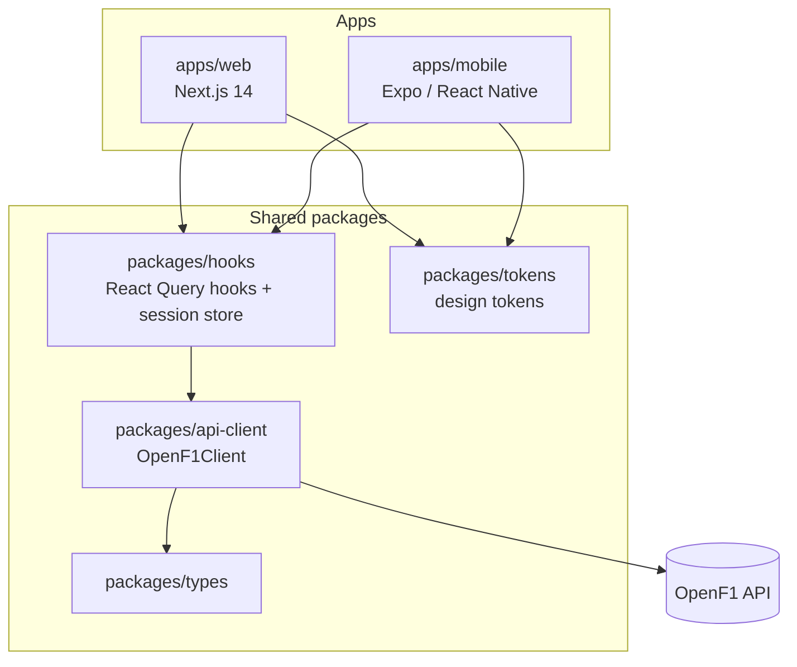

# F1 Dashboard

[](https://github.com/Aravind-7/formula1_live/actions/workflows/ci.yml)

A live and historical Formula 1 dashboard built on the [OpenF1](https://openf1.org) API, with a Next.js web app and an Expo/React Native mobile app sharing one data layer. Shows a live-session banner and real-time leaderboard/telemetry when a session is in progress, and a browsable history of past sessions — including scroll-driven race recaps — otherwise.

## Live

- **Web:** _add your Vercel URL here after deploying (see [Deployment](#deployment))_
- **Mobile:** _add a TestFlight/Play link or an Expo Go QR code here after building (see [Deployment](#deployment))_

## Features

- Live-session banner and replay-mode toggle when no session is currently live
- Real-time leaderboard (positions + intervals) with `aria-live` announcements for screen readers
- Weather, fastest lap, tire strategy, and team radio cards
- Interactive track map: driver dots are hoverable and keyboard-navigable (`Tab`/`Enter`/`Space`), selection is synced to the `?driver=` URL query param
- Driver detail page with lap-time and car-data (speed/throttle/brake) telemetry charts
- Race recap pages (statically generated) with a scroll-driven track map replay and podium/stat callouts
- Mobile app mirrors the dashboard, track map, and driver detail screens natively
- Loading skeletons, empty states, and retry-able error states on every data-dependent panel

## Stack

- **Monorepo:** pnpm workspaces + Turborepo
- **Web:** Next.js 14 (App Router), TypeScript, Tailwind CSS, TanStack Query, Recharts, d3-scale
- **Mobile:** Expo (SDK 57) + Expo Router, NativeWind, react-native-svg, Zustand
- **Shared packages:** `api-client` (typed OpenF1 fetch wrapper), `hooks` (React Query hooks + session store, reused by both apps), `types`, `tokens` (design tokens)
- **Testing:** Vitest + React Testing Library (unit/component), Playwright (e2e smoke)
- **CI/CD:** GitHub Actions, Vercel (web), EAS Build (mobile)
- **Data:** [OpenF1](https://api.openf1.org/v1) — no auth required

## Architecture



Dependencies flow one way: `tokens` and `types` have no internal dependencies → `api-client` depends on `types` → `hooks` depends on `api-client` → both apps depend on `hooks` and `tokens`. Nothing in `packages/*` imports from `apps/*`, which is what keeps the shared packages usable by both the web and mobile apps.

<details>
<summary>Request flow example: loading the session selector (<code>/</code>)</summary>

```
Browser requests "/"
      │
      ▼
app/layout.tsx          renders <html>, wraps children in <Providers> (QueryClientProvider)
      │
      ▼
app/page.tsx             export const dynamic = "force-dynamic" — always runs fresh, never statically cached
  ├─ <main> renders immediately, wraps data-dependent content in <Suspense fallback={<SessionListSkeleton />}>
  └─ SessionSelectorContent() (async Server Component) runs on the server:
        │
        ├─ new OpenF1Client()                       (packages/api-client)
        ├─ client.getSessions({year}) ──┐
        ├─ client.getMeetings({year}) ──┤  both call openF1Fetch() → real fetch to api.openf1.org
        │                                │
        ├─ joinSessionsWithMeetings()    (apps/web/lib/sessions.ts) — merges the two arrays using
        │                                 Session/Meeting types from packages/types, sorts by date desc
        ├─ findLiveSession()             — picks the currently-live session, if any
        │
        ├─ <LiveBanner session={live}>   (only rendered if a session is live)
        ├─ <h2>Recent sessions</h2>
        └─ <SessionSelectorList sessions={joined}>          client component — owns search input state
                 │
                 └─ renders <SessionCard> per session, each a <Link href="/dashboard/[sessionKey]">
```

All colors/spacing/type sizes used above come from `packages/tokens` via each app's Tailwind/NativeWind theme config; nothing is hardcoded in the components themselves.

</details>

## Structure

```
apps/
  web/          Next.js app (dashboard, track map, driver detail, recap pages)
    e2e/        Playwright smoke tests
  mobile/       Expo / React Native app (same core screens, native primitives)
packages/
  api-client/   OpenF1Client — typed fetch wrapper
  types/        shared TypeScript types
  hooks/        shared React Query hooks + Zustand session store
  tokens/       design tokens (colors, typography, spacing)
.github/
  workflows/    CI pipeline (lint, test, build)
```

## Getting started

```bash
pnpm install
pnpm dev
```

The web app runs at [http://localhost:3000](http://localhost:3000). To run the mobile app in Expo Go:

```bash
pnpm --filter @f1-dashboard/mobile start
```

## Testing

```bash
pnpm test                                    # Vitest — packages/hooks, packages/api-client, apps/web
pnpm --filter @f1-dashboard/web test:e2e     # Playwright smoke tests (spins up its own dev server on :3100)
pnpm lint
pnpm typecheck
pnpm build
```

## Deployment

**Web (Vercel):**
1. Import this repo into Vercel — it auto-detects Next.js.
2. In Project Settings → Build & Development, set **Root Directory** to `apps/web`. [`apps/web/vercel.json`](apps/web/vercel.json) points the install/build commands back at the monorepo root so pnpm/Turborepo can resolve the shared workspace packages, and filters the build to the `@f1-dashboard/web` package specifically.
3. No environment variables are required — OpenF1 needs no auth.

**Mobile (EAS Build):**
```bash
cd apps/mobile
pnpm exec eas login
pnpm exec eas build:configure    # links the project, writes an EAS project id into app.json
pnpm exec eas build --platform all --profile preview
```
[`apps/mobile/eas.json`](apps/mobile/eas.json) defines the `preview` profile (internal distribution, so builds are shareable without app store review) alongside `development` and `production`. Distribute the preview build via TestFlight / the Play internal testing track, or for a quick portfolio demo, just run `pnpm --filter @f1-dashboard/mobile start` and scan the QR code in Expo Go.

## Design

Dark mode only. Flat surfaces, hairline borders instead of shadows, color reserved for meaning (live indicators, timing signals, selection state) rather than decoration — every signal color is paired with a non-color cue (label, icon, or border) so nothing depends on color alone. All colors are defined once in `packages/tokens` and consumed via each app's theme config — no hardcoded hex values in components. The full palette is contrast-checked against WCAG AA (4.5:1) for body text on both background surfaces.

## What I'd build next

- Swap the polling-based live leaderboard/telemetry for a websocket feed once OpenF1 exposes one, to cut refresh latency below the current few-second interval
- A session-over-session comparison view — overlay two drivers' lap-time deltas on the recap track map
- Push notifications on mobile for race-control flags/safety cars during a live session
- Offline caching of recap pages on mobile, so past-race demos work without a connection
- Wider Playwright coverage: the driver telemetry page and the recap scroll-replay interaction, not just the two smoke flows above
